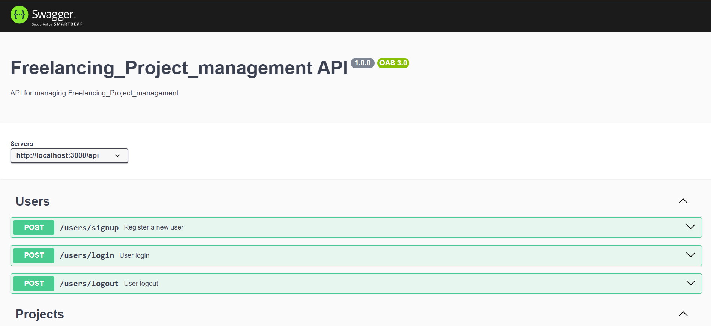
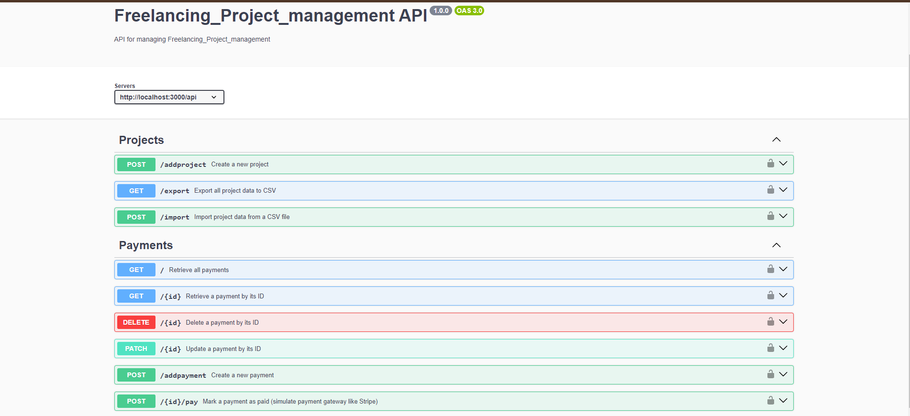

<h1 align="center">MERN-Backend Freelancing_Project_Management</h1>


# Project & Payment Management API

This is a Node.js and Express.js application for managing projects and payments. It also includes bulk data export/import functionality and simulates a basic payment process.

## Table of Contents
- [Features](#features)
- [Installation](#installation)
- [Environment Variables](#environment-variables)
- [Usage](#usage)
- [API Endpoints](#api-endpoints)
  - [Project Management](#project-management)
  - [Payment Management](#payment-management)
- [Bulk Data Export/Import](#bulk-data-exportimport)
- [Payment Simulation](#payment-simulation)
- [Swagger Documentation](#swagger-documentation)

## Features

- CRUD operations for project and payment management.
- Bulk data export to CSV for projects.
- Bulk data import from CSV to create multiple projects.
- Payment simulation to mark payments as "paid" (mocked payment gateway).
- Authentication and authorization using JWT.
- Swagger documentation for easy API interaction.


## Expense Swagger UI


<br>



### Setup .env file

```bash
DATABASE_URL=Your_mongo_url
PORT=Sevice_port
NODE_ENV=NODE_ENVIRINMENT
JWT_SECRET=jwt_secret
```

### Run this app locally

```shell
npm run build
```

### Start the app

```shell
npm start
```
